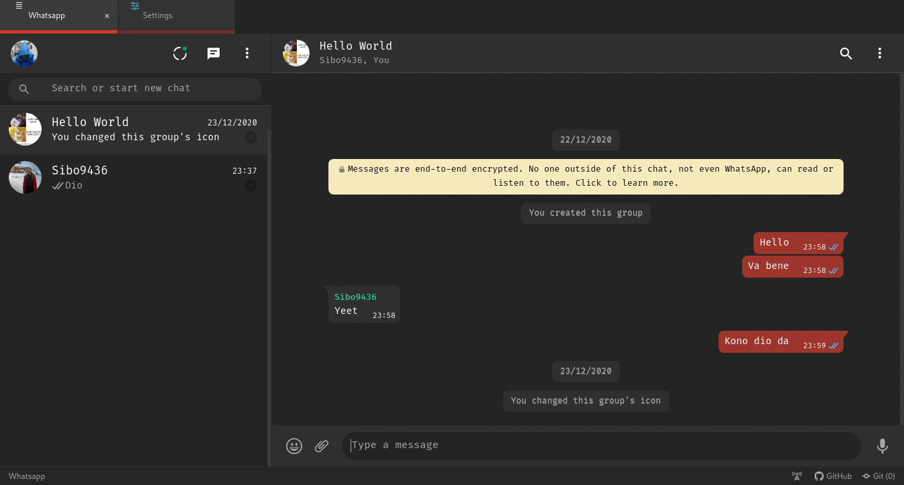

# WhatsApp web for Atom

Open [WhatsApp web](https://web.whatsapp.com) directly inside your favorite editor [atom](https://github.com/atom/atom).



Share code using [gist-it](https://github.com/rhysforyou/gist-it) with your fellow coders.

## Features

This package provides the options (toggled on by default) to use WhatsApp web inside atom editor with the same colorscheme and fonts set in the application. To open WhatsApp just use the keybinding Ctrl+Alt+m.

## Installation

### Command Line

1. Install [Atom 1.40](https://atom.io/)
2. In the terminal run command:
```
apm install atom-whatsapp
```

### GUI

1. Install Atom 1.40 or newer
2. Launch Atom
3. Open Settings View using Cmd+, on macOS or Ctrl+, on other platforms
4. Click the Install tab on the left side
5. Enter atom-whatsapp in the search box and press Enter
6. Click the "Install" button that appears

## Screenshots


